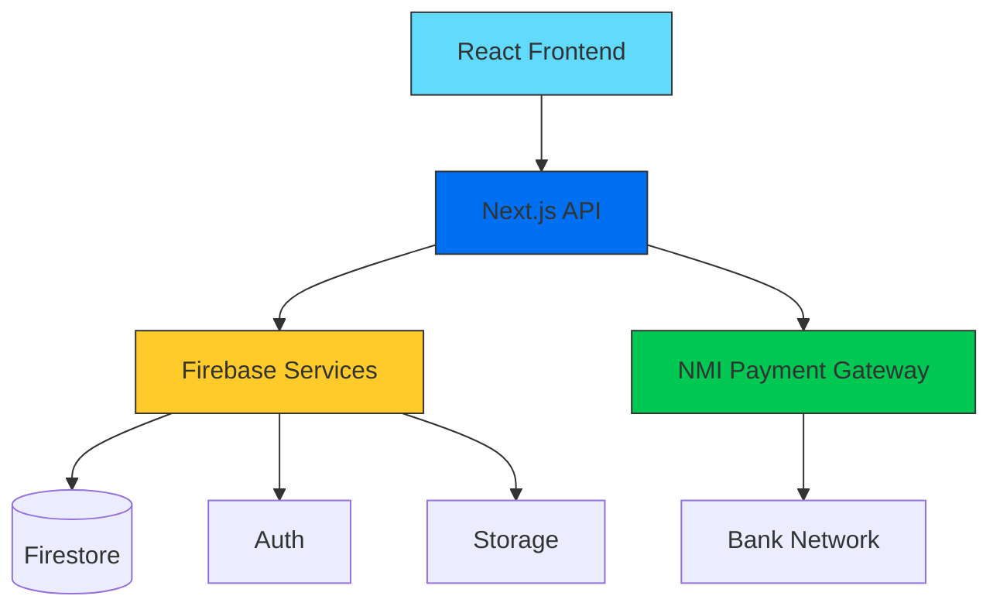
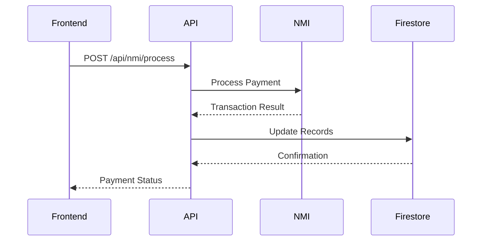

# System Architecture

## Component Diagram


## Payment Flow


## Key Relationships
- See [Database Schema](db.md) for data model details
- [API Documentation](#api-endpoints) for integration points

## Error Handling
```mermaid
graph TD
    A[Request] --> B{Valid?}
    B -->|Yes| C[Process]
    B -->|No| D[Return 400]
    C --> E{Success?}
    E -->|Yes| F[Return 200]
    E -->|No| G[Retry Logic]
    G --> H{Retries < 3?}
    H -->|Yes| C
    H -->|No| I[Log Error]
