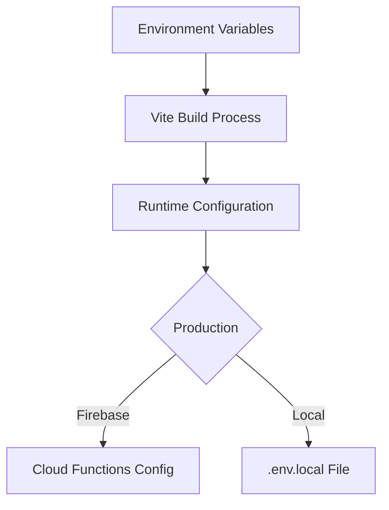

# Database Documentation

## Overview
This document provides a comprehensive overview of the database structure, including all collections, documents, and fields.

## Collections

### Customers Collection
Collection path: `/customers`

Each document represents a customer with the following fields:

| Field | Type | Description |
|-------|------|-------------|
| `id` | `string` | Unique identifier for the customer |
| `firstName` | `string` | Customer's first name |
| `lastName` | `string` | Customer's last name |
| `email` | `string` | Customer's email address |
| `phone` | `string` | Customer's phone number |
| `type` | `'Owner' \| 'Renter'` | Type of customer |
| `cabinNumber` | `string` | Assigned cabin number |
| `street` | `string` | Street address |
| `city` | `string` | City |
| `state` | `string` | State/Province |
| `zip` | `string` | ZIP/Postal code |
| `country` | `string` | Country |
| `numberOfGuests` | `number` | Number of guests |
| `notes` | `string?` | Additional notes about the customer (optional) |
| `createdAt` | `Date` | Timestamp of customer creation |
| `status` | `'active' \| 'inactive'` | Customer's current status |
| `paymentStatus` | `'paid' \| 'pending' \| 'overdue'` | Customer's payment status |
| `sailDate` | `string?` | Optional sailing date |
| `companyId` | `string` | Associated company identifier |

#### Customer Documents Subcollection
Collection path: `/customers/{customerId}/documents`

Each document in this subcollection represents a customer document:

| Field | Type | Description |
|-------|------|-------------|
| `id` | `string` | Document identifier |
| `name` | `string` | Document name |
| `type` | `string` | Document type |
| `url` | `string` | Document storage URL |
| `uploadedAt` | `Date` | Upload timestamp |
| `size` | `number` | File size in bytes |

### Invoices Collection
Collection path: `/invoices`

Each document represents an invoice with the following fields:

| Field | Type | Description |
|-------|------|-------------|
| `id` | `string` | Unique identifier for the invoice |
| `invoiceNumber` | `string` | Human-readable invoice number |
| `customerId` | `string` | Reference to customer ID |
| `customerName` | `string` | Customer's full name |
| `customerEmail` | `string` | Customer's email |
| `customerAddress` | `string` | Customer's full address |
| `date` | `string` | Invoice creation date |
| `dueDate` | `string` | Payment due date |
| `items` | `LineItem[]` | Array of line items |
| `subtotal` | `number` | Sum before tax |
| `taxRate` | `number` | Applied tax rate |
| `taxAmount` | `number` | Calculated tax amount |
| `platformFee` | `number` | Platform fee amount |
| `total` | `number` | Final total amount |
| `notes` | `string?` | Optional invoice notes |
| `status` | `'draft' \| 'sent' \| 'paid' \| 'overdue' \| 'cancelled'` | Current invoice status |
| `paymentMethods` | `('credit_card' \| 'ach')[]` | Allowed payment methods |
| `paymentLink` | `string` | Generated payment URL |
| `poNumber` | `string?` | Optional purchase order number |
| `paymentTerms` | `'due_on_receipt' \| 'net_15' \| 'net_30' \| 'net_60'` | Payment terms |
| `companyId` | `string` | Associated company identifier |
| `createdAt` | `Date` | Creation timestamp |
| `updatedAt` | `Date` | Last update timestamp |

#### Line Item Structure
Each line item in the `items` array contains:

| Field | Type | Description |
|-------|------|-------------|
| `id` | `string` | Unique identifier for the line item |
| `description` | `string` | Item description |
| `quantity` | `number` | Quantity of items |
| `unitPrice` | `number` | Price per unit |
| `total` | `number` | Total for this line item |
| `isTaxable` | `boolean` | Whether tax applies |

### Transactions Collection
Collection path: `/transactions`

Each document represents a payment transaction:

| Field | Type | Description |
|-------|------|-------------|
| `id` | `string` | Unique transaction identifier |
| `date` | `string` | Transaction date |
| `customerId` | `string` | Reference to customer |
| `customerName` | `string` | Customer's name |
| `amount` | `number` | Transaction amount |
| `status` | `'paid' \| 'failed' \| 'refunded'` | Transaction status |
| `cardLast4` | `string` | Last 4 digits of card |
| `transactionId` | `string` | Payment processor's transaction ID |
| `description` | `string` | Transaction description |
| `failureReason` | `string?` | Optional failure explanation |
| `companyId` | `string` | Associated company identifier |
| `createdAt` | `Date` | Creation timestamp |
| `updatedAt` | `Date` | Last update timestamp |

### Company Settings Collection
Collection path: `/settings`

Each document contains company-specific settings:

| Field | Type | Description |
|-------|------|-------------|
| `id` | `string` | Company identifier |
| `name` | `string` | Company name |
| `logo` | `string` | URL to company logo |
| `address` | `object` | Company address object |
| `email` | `string` | Company email |
| `phone` | `string` | Company phone |
| `taxId` | `string` | Tax identification number |
| `platformFee` | `number` | Platform fee percentage |
| `defaultTaxRate` | `number` | Default tax rate |
| `emailSettings` | `object` | Email configuration |
| `wikiPayitSettings` | `object` | Payment processor settings |
| `invoiceNumbering` | `object` | Invoice number format settings |
| `invoiceSettings` | `object` | Invoice display settings |
| `createdAt` | `Date` | Creation timestamp |
| `updatedAt` | `Date` | Last update timestamp |
| `ownerId` | `string` | Company owner's user ID |

#### Address Object Structure
| Field | Type | Description |
|-------|------|-------------|
| `street` | `string` | Street address |
| `city` | `string` | City |
| `state` | `string` | State/Province |
| `country` | `string` | Country |
| `zip` | `string` | ZIP/Postal code |

#### Email Settings Object Structure
| Field | Type | Description |
|-------|------|-------------|
| `sendgridApiKey` | `string` | SendGrid API key |
| `fromEmail` | `string` | Default sender email |
| `invoiceTemplate` | `string` | Base invoice template |
| `paymentRequest` | `string` | Payment request template |
| `paymentThankYou` | `string` | Payment confirmation template |
| `refundIssued` | `string` | Refund notification template |
| `paymentFailed` | `string` | Failed payment template |
| `paymentRequestSubject` | `string` | Payment request email subject |
| `paymentThankYouSubject` | `string` | Thank you email subject |
| `refundIssuedSubject` | `string` | Refund email subject |
| `paymentFailedSubject` | `string` | Failed payment email subject |

#### WikiPayit Settings Object Structure
| Field | Type | Description |
|-------|------|-------------|
| `tokenizationKey` | `string` | Frontend tokenization key |
| `securityKey` | `string` | Backend API key |
| `username` | `string` | API username |

#### Invoice Settings Object Structure
| Field | Type | Description |
|-------|------|-------------|
| `showLogo` | `boolean` | Display company logo |
| `enablePlatformFee` | `boolean` | Add platform fee |
| `industry` | `string` | Industry type |
| `enableAchPayments` | `boolean` | Allow ACH payments |
| `invoiceStartingNumber` | `number` | First invoice number |
| `enableDatePrefix` | `boolean` | Add date to invoice numbers |
| `colors` | `object` | Color customization settings |
| `colors.primary` | `string` | Main brand color for elements and buttons |
| `colors.secondary` | `string` | Secondary accent color |
| `colors.headerText` | `string` | Color for header and section titles |
| `colors.tableHeader` | `string` | Background color for table headers |
| `colors.totalText` | `string` | Color for total amounts and figures |
| `colors.linkText` | `string` | Color for clickable links and actions |
| `template` | `'modern' \| 'classic' \| 'minimal'` | Invoice template style |
| `numberFormat` | `string` | Invoice number format |
| `zeroPadding` | `number` | Number padding length |
| `resetNumberSequence` | `'annually' \| 'never'` | Number reset frequency |
| `dateFormat` | `string` | Date display format |
| `customFooterText` | `string` | Custom footer content |
| `defaultDueTerms` | `string` | Default payment terms |
| `defaultNotes` | `string` | Default invoice notes |
| `showUnpaidWatermark` | `boolean` | Show unpaid watermark |
| `showPaidWatermark` | `boolean` | Show paid watermark |

### Users Collection
Collection path: `/users`

Each document represents a system user:

| Field | Type | Description |
|-------|------|-------------|
| `uid` | `string` | Firebase Auth UID |
| `email` | `string` | User's email |
| `displayName` | `string` | User's display name |
| `photoURL` | `string?` | Profile picture URL (optional) |
| `role` | `'admin' \| 'manager' \| 'user'` | User role |
| `id` | `string` | Internal user ID |
| `companyId` | `string` | Associated company |
| `createdAt` | `Date` | Account creation date |
| `updatedAt` | `Date` | Last update date |
| `lastLoginAt` | `Date` | Last login timestamp |
| `isActive` | `boolean` | Account status |
| `metadata` | `Record<string, any>` | Additional user data |

### Products Collection
Collection path: `/products`

Each document represents a product or service:

| Field | Type | Description |
|-------|------|-------------|
| `id` | `string` | Product identifier |
| `companyId` | `string` | Associated company |
| `name` | `string` | Product name |
| `description` | `string` | Product description |
| `category` | `string` | Product category |
| `price` | `number` | Unit price |
| `isTaxable` | `boolean` | Tax applicability |
| `isSubscription` | `boolean` | Subscription product |
| `billingCycle` | `'monthly' \| 'quarterly' \| 'yearly'` | Subscription period |
| `stockQuantity` | `number` | Available stock |
| `lowStockAlert` | `number` | Low stock threshold |
| `sku` | `string` | Stock keeping unit |
| `createdAt` | `Date` | Creation timestamp |
| `updatedAt` | `Date` | Last update timestamp |

### Categories Collection
Collection path: `/categories`

Each document represents a product category:

| Field | Type | Description |
|-------|------|-------------|
| `id` | `string` | Category identifier |
| `companyId` | `string` | Associated company |
| `name` | `string` | Category name |
| `createdAt` | `Date` | Creation timestamp |
| `updatedAt` | `Date` | Last update timestamp |

### Company Profile Collection
Collection path: `/companyProfile`

Each document contains extended company information:

| Field | Type | Description |
|-------|------|-------------|
| `id` | `string` | Profile identifier |
| `companyId` | `string` | Reference to company |
| `description` | `string` | Company description |
| `website` | `string?` | Company website (optional) |
| `socialMedia` | `object?` | Social media links (optional) |
| `businessHours` | `object` | Operating hours |
| `timezone` | `string` | Company timezone |
| `createdAt` | `Date` | Creation timestamp |
| `updatedAt` | `Date` | Last update timestamp |

## Relationships

- Customers → Invoices: One-to-Many (via `customerId`)
- Customers → Transactions: One-to-Many (via `customerId`)
- Companies → Users: One-to-Many (via `companyId`)
- Companies → Products: One-to-Many (via `companyId`)
- Companies → Categories: One-to-Many (via `companyId`)
- Categories → Products: One-to-Many (via `category`)
- Products → Line Items: One-to-Many (via product reference)
- Companies → Company Profile: One-to-One (via `companyId`)
- Customers → Documents: One-to-Many (via customer subcollection)

## Indexes

Recommended indexes for optimal performance:

1. Customers Collection:
   - `email` (unique)
   - `status`
   - `paymentStatus`
   - `companyId`
   - Compound: `companyId, createdAt`

2. Invoices Collection:
   - `customerId`
   - `status`
   - `companyId`
   - Compound: `companyId, createdAt`
   - Compound: `customerId, createdAt`

3. Transactions Collection:
   - `customerId`
   - `status`
   - `companyId`
   - Compound: `companyId, date`
   - Compound: `customerId, date`

4. Products Collection:
   - `category`
   - `companyId`
   - Compound: `companyId, category`

5. Users Collection:
   - `email` (unique)
   - `companyId`
   - `role`

## Notes

1. Payment Methods Handling:
   - The `paymentMethods` field in invoices is stored as an array of strings (`['credit_card', 'ach']`)
   - In the application forms, it's handled as an object with boolean flags (`{ credit_card: true, ach: false }`)
   - The transformation between these formats is handled in the invoice creation/update logic

2. Optional Fields:
   - Fields marked with `?` are optional
   - Optional fields may be undefined or null in the database

3. Timestamps:
   - All `Date` fields are stored as Firestore timestamps
   - Date strings should follow ISO 8601 format

## Security Implementation

### Firestore Rules
```javascript
rules_version = '2';
service cloud.firestore {
  match /databases/{database}/documents {
    // Company data isolation
    match /companies/{companyId} {
      allow read, write: if request.auth != null 
        && request.auth.token.companyId == companyId
        && request.auth.token.role in ['admin', 'manager'];
      
      match /users/{userId} {
        allow read: if request.auth.uid == userId;
        allow write: if request.auth.token.role == 'admin';
      }
    }
    
    // Payment data protection
    match /transactions/{transactionId} {
      allow read: if request.auth.token.role in ['admin', 'manager'];
      allow create: if request.resource.data.keys().hasAll(['amount', 'status'])
        && request.auth.token.role == 'admin';
    }
  }
}
```

### Key Security Practices
1. **Data Isolation**  
   - Company data segmented by `companyId` in all collections
   - User records contain `companyId` from Firebase auth claims
   
2. **Payment Processing**  
   - Never store raw payment credentials
   - Use NMI tokenization for card data
   - PCI-DSS compliant through NMI integration
   
3. **Secret Management**  


4. **Audit Logging**  
   - All write operations create audit entries in `system_logs` collection
   - Log format:
   ```typescript
   interface SystemLog {
     action: 'create'|'update'|'delete';
     collection: string;
     documentId: string;
     user: string; // Firebase UID
     timestamp: Date;
     beforeState?: object;
     afterState?: object;
   }
   ```

## Backup and Recovery

The following data should be prioritized for backup:

1. Customer information
2. Transaction records
3. Invoice history
4. Company settings
5. User accounts

Recommended backup frequency:
- Transactional data: Real-time
- Settings and configurations: Daily
- Historical data: Weekly

## Data Retention

Consider the following retention policies:

1. Transactions: 7 years (legal requirement)
2. Invoices: 7 years
3. Customer data: As long as active + 2 years
4. Audit logs: 2 years
5. User session data: 90 days
