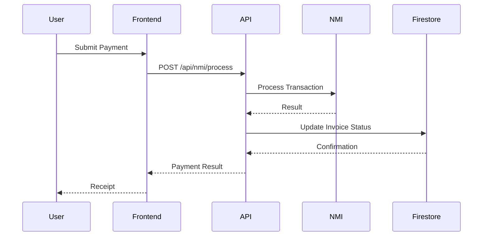
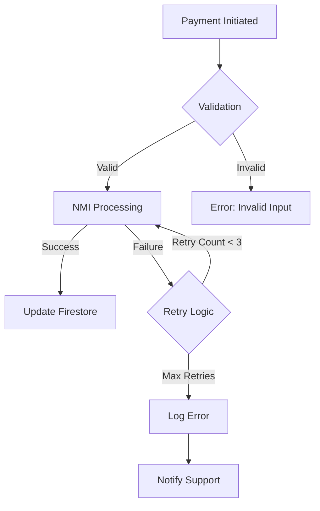

# Payment Processing Flow

## Sequence Diagram

## Error Handling

## Related Documents
- [Database Schema](db.md)
- [API Documentation](#)
- [Security Implementation](db.md#security-implementation)
